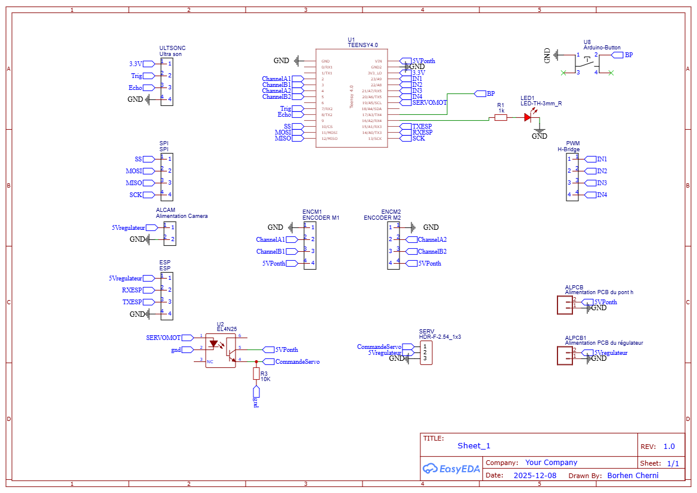
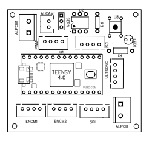
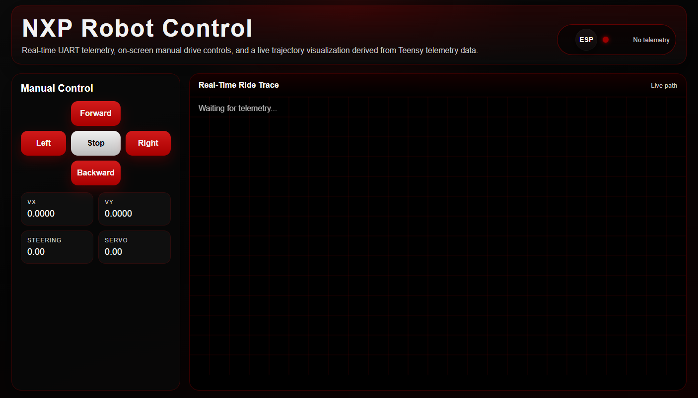

# NXP Cup Robot

This repository contains the software, electronics, mechanical references, and documentation for the NXP Cup lane-following competition robot.
The current implementation is centered on two main embedded targets:

- a Teensy 4.0 control unit that handles line tracking, steering, motor control, and telemetry generation
- an ESP32 interface board that provides a web dashboard, manual drive controls, and live trajectory visualization

## Project Overview 🤖

The robot is designed to follow a track as consistently and efficiently as possible while remaining debuggable during development.
The software is organized so that the core logic is separated into small header/source modules, making the control flow easier to maintain and inspect.
The goal of this document is to describe the robot, the role of each code part, and the current development phases in a way that matches the actual project structure.

## System Architecture ⚙️

### Teensy 4.0 🧠

The Teensy is the main real-time controller. It is responsible for:

- reading the Pixy2 line camera data
- normalizing and fusing detected line vectors
- computing a lookahead point for steering
- applying PID-style steering correction
- detecting lane sides and special line patterns
- driving the motors and steering servo
- reading the ultrasonic distance sensor
- sending telemetry packets to the ESP32 over UART

The Teensy code is organized into focused modules under `NXPcup/include` and `NXPcup/src/teensy`:

- `teensy_config.h` for constants, pins, and tuning values
- `teensy_state.h` and `teensy_state.cpp` for shared robot state
- `teensy_motors.h` and `teensy_motors.cpp` for motor and servo output
- `teensy_sensors.h` and `teensy_sensors.cpp` for ultrasonic sensing
- `teensy_vision.h` and `teensy_vision.cpp` for Pixy2 processing and steering logic
- `main_teensy.cpp` as the control entrypoint

### ESP32 Interface 🌐

The ESP32 acts as the operator interface and telemetry gateway. It is responsible for:

- receiving telemetry packets from the Teensy through UART
- exposing a Wi-Fi access point
- serving a browser-based control dashboard
- sending manual drive commands back to the Teensy
- drawing the robot trajectory in real time from received points

The ESP32 code is organized into:

- `esp_config.h` for UART and access point settings
- `esp_telemetry.h` and `esp_telemetry.cpp` for packet parsing, point history, and command forwarding
- `esp_web.h` and `esp_web.cpp` for the HTML interface and HTTP routes
- `main_esp.cpp` as the entrypoint

## Control Logic 🧭

The Teensy control loop follows a clear sequence:

1. Read all Pixy2 line features
2. Normalize line vector direction
3. Fuse valid vectors into a single motion estimate
4. Normalize the fused vector
5. Compute an adaptive lookahead point
6. Convert the lookahead error into steering correction
7. Apply lane-side correction when only one side of the track is visible
8. Clamp and smooth the servo command
9. Drive the motors
10. Send telemetry to the ESP32

The telemetry packet format is:

`D,vx,vy,steeringangle,servoangle`

The ESP32 manual command format is:

`C,<command>`

Where the current commands are:

- `F` for forward
- `B` for backward
- `L` for left
- `R` for right
- `S` for stop

The current control strategy focuses on lane following and smooth steering.
The robot can be further developed by adding velocity regulation and speed profiling, in the style of the `code asservissement vitesse` approach, to keep the speed more stable across straights, curves, and transitions.

## Phases Of Working 🔄

### 1. Perception

The Pixy2 camera runs in line-tracking mode and the Teensy extracts track geometry from the visible vectors.
This phase focuses on identifying the path, rejecting noise, and understanding sharp turns, lane boundaries, and horizontal markers.

### 2. Motion Estimation

The detected vectors are filtered and fused into a single direction estimate.
A lookahead point is then computed so the robot can react smoothly on straights and more aggressively in curves.

### 3. Steering And Drive Control

The steering output is computed from the lookahead error and adjusted with PID-style terms.
The motor speed and servo angle are then constrained to keep motion stable.

### 4. Telemetry And Debugging

The Teensy sends live telemetry to the ESP32 so the robot can be observed while running.
This data includes vector direction, steering output, and servo angle.

### 5. Operator Interface

The ESP32 hosts a browser dashboard with manual drive buttons and a live trace of the robot path.
The LED status indicator changes color based on whether telemetry is being received.

### 6. Mechanical And Electrical Integration

The CAD, PCB, and wiring notes are used to assemble the chassis, sensors, drivetrain, and electronics reliably.
This phase ties the software to the physical robot.

## Mechanical Part 🛠️

The mechanical part covers the chassis, steering, drivetrain, and mounting system.
These references are useful for assembly, servicing, and mechanical debugging.

### Robot Assembly


### Mechanical Design


## Electrical Part ⚡

The electrical part covers the wiring, PCB layout, power distribution, and interface hardware.
These elements support the sensors, controller, motor driver, and communication links.

### System Schematic



### PCB Routing


### PCB Overview



### Validation Videos 🎥

The following videos are used to validate different layers of the system during development:

- `video for the robot completing one lap.mp4` for the robot completing one lap
- `video for the robot stopping when detecting the box.mp4` for the robot stopping test

<video controls width="100%" src="video for the robot completing one lap.mp4"></video>

<video controls width="100%" src="video for the robot stopping when detecting the box.mp4"></video>

## Pins And Hardware Notes 📌

Current Teensy pin usage:

- motor inputs: 22, 23, 6, 7
- servo output: 8
- ultrasonic trigger: 18
- ultrasonic echo: 19

The project uses:

- Teensy 4.0 as the controller
- Pixy2 in line mode
- steering servo
- H-bridge motor driver
- ultrasonic distance sensor
- ESP32 for telemetry and control UI

## Web Interface 🖥️

The ESP32 dashboard uses a dark industrial theme based on black, white, and `#AA0000` red accents.
It includes:

- forward, backward, left, right, and stop buttons
- a circular `ESP` badge with a connection LED
- live telemetry readouts
- a black canvas with a white trail showing the robot path in real time

### Web Interface Preview



## Software Layout 💻

The main source folders are:

- `NXPcup/src/teensy` for the Teensy 4.0 control code
- `NXPcup/src/esp` for the ESP32 dashboard and UART bridge
- `NXPcup/include` for shared headers and configuration
- `NXPcup/lib` for legacy or reusable helper sources
- `notes` for pinout and power notes
- `Mécanique` for CAD and mechanical references

### Code Roles 🧩

The code is split so each module has a clear role in the robot:

- `main_teensy.cpp` runs the full real-time control loop and coordinates perception, steering, drive output, and telemetry
- `teensy_vision.cpp` handles Pixy2 processing, vector fusion, lane detection, and steering computation
- `teensy_motors.cpp` converts high-level speed commands into motor outputs and servo control
- `teensy_sensors.cpp` reads the ultrasonic sensor used for distance checking
- `teensy_state.cpp` stores the shared robot state used by the other Teensy modules
- `main_esp.cpp` initializes the ESP32 system and connects the web dashboard to UART telemetry
- `esp_telemetry.cpp` parses telemetry packets, stores path points, and forwards manual commands
- `esp_web.cpp` serves the browser interface, controls the buttons, and draws the live ride trace

### Development Note 🚀

The robot can also be extended with velocity regulation and speed profiling in the style of `code asservissement vitesse` to stabilize motion across straights, curves, and transitions.

## Power And Wiring Notes 🔌

The project notes indicate the following supply plan:

- Teensy: 5V
- camera: external 5V
- servo: external 5V
- motors: 12V
- ultrasonic sensor: 3.3V
- logic and power grounds must be shared where required

## Build And Run 🏗️

The PlatformIO project is configured for the Teensy environment in `NXPcup/platformio.ini`.
Typical workflow:

1. open the `NXPcup` folder in PlatformIO or VS Code
2. build the Teensy environment
3. upload to the Teensy board
4. power the ESP32 and open the Wi-Fi dashboard
5. watch the telemetry stream and path trace in the browser

Example build command:

```powershell
cd NXPcup
platformio run -e teensy40
```

## Resources 📚

- [Enseirb NXP Cup 2019 ](https://github.com/Enseirb-NXP-Cup-2019/cars/blob/master/src/Arduino/suivi_piste.ino)
- [Enseirb NXP Cup 2019 website](https://github.com/Enseirb-NXP-Cup-2019/nxpcup.enseirb.github.io?tab=readme-ov-file)
- [Electromaker NXP Cup project](https://www.electromaker.io/project/view/nxp-cup-project)
- [NXP-CUP-FINALS](https://github.com/aminebensaid66/NXP-CUP-FINALS)                     

## Notes 📝

This documentation reflects the current modularized Teensy and ESP32 codebase.
It is intended to help with debugging, maintenance, and competition preparation by keeping the code paths, hardware roles, and project assets in one place.
